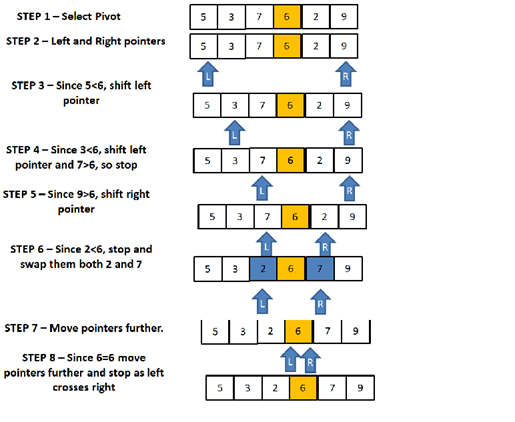

# What is Quick Sort?
Quick sort follows Divide and Conquer algorithm. It is dividing elements in to smaller parts based on some condition and performing the sort operations on those divided smaller parts. Hence, it works well for large datasets. So, here are the steps how Quick sort works in simple words.

- First select an element which is to be called as pivot element.
- Next, compare all array elements with the selected pivot element and arrange them in such a way that, elements less than the pivot element are to it's left and greater than pivot is to it's right.
- Finally, perform the same operations on left and right side elements to the pivot element.

So, that is the basic outline of Quick sort. Here are the steps which need to be followed one by one to perform Quick sort.

### How does QuickSort Work
1. First find the "pivot" element in the array.
2. Start the left pointer at first element of the array.
3. Start the right pointer at last element of the array.
4. Compare the element pointing with left pointer and if it is less than the pivot element, then move the left pointer to the right (add 1 to the left index). Continue this until left side element is greater than or equal to the pivot element.
5. Compare the element pointing with right pointer and if it is greater than the pivot element, then move the right pointer to the left (subtract 1 to the right index). Continue this until right side element is less than or equal to the pivot element.
6. Check if left pointer is less than or equal to right pointer, then saw the elements in locations of these pointers.
7. Increment the left pointer and decrement the right pointer.
8. If index of left pointer is still less than the index of the right pointer, then repeat the process; else return the index of the left pointer.

