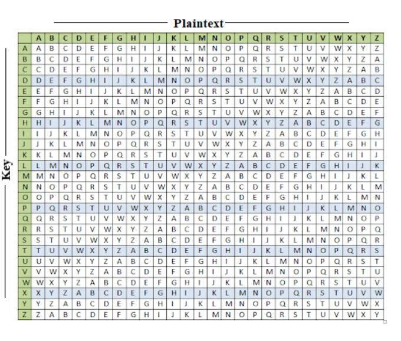

<h3 align="justify"><b>What is Vigenere Cipher?</b> </h3>

The vigenere cipher is an algorithm that is used to encrypting and decrypting the text. The vigenere cipher is an algorithm of encrypting an alphabetic text that uses a series of interwoven caesar ciphers. It is based on a keyword's letters. It is an example of a polyalphabetic substitution cipher. This algorithm is easy to understand and implement. This algorithm was first described in 1553 by Giovan Battista Bellaso. It uses a Vigenere table or Vigenere square for encryption and decryption of the text. The vigenere table is also called the tabula recta. 

When the vigenere table is given, the encryption and decryption are done using the vigenere table (26 * 26 matrix).

<h3 align="justify">Encryption:</h3>

There are 2 inputs:

<ul>
<li>Plaintext: Text that is to be encrypted</li>
<li>Key: key used for encryption</li>
</ul>  

The key is first repeated as long as the length of the key is not equal to the given plain text. Then the first letter of the plaintext is combined with the first letter of the key and the equivalent cell of the matrix is taken. The work in the cell is the encrypted letter. The same procedure is repeated over the entire plaintext to encrypt it.

Ref: https://www.javatpoint.com/vigenere-cipher

